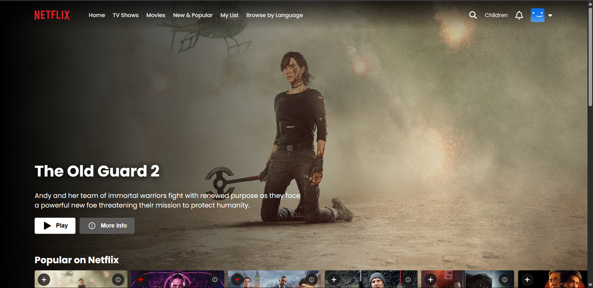
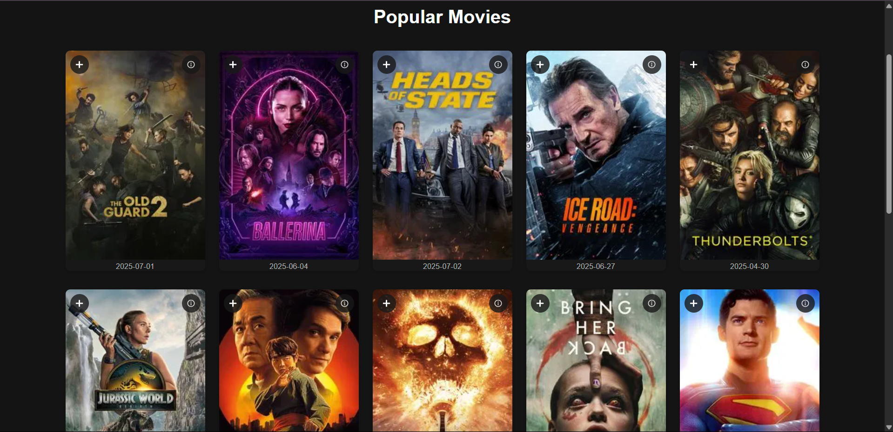
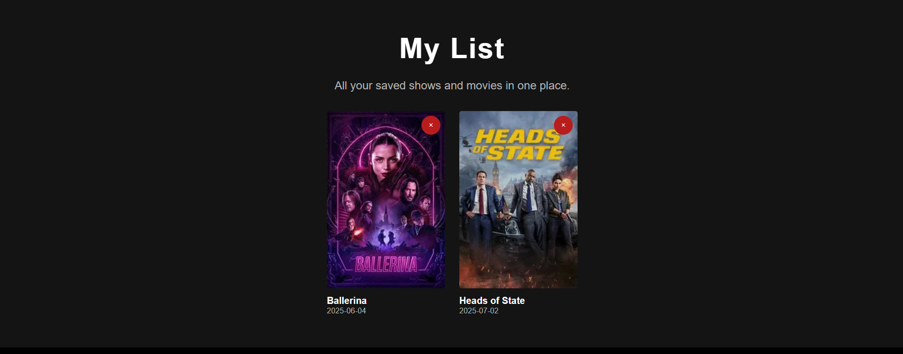
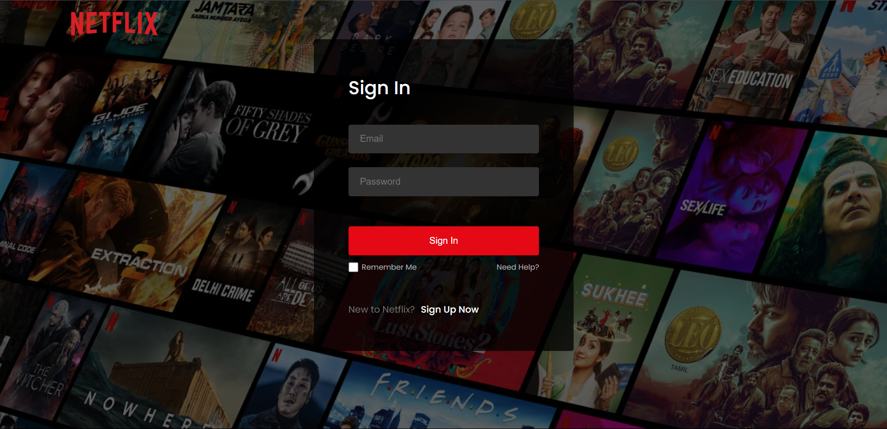

# Netflix Clone 🎬

A beautiful, responsive Netflix clone built with React, Vite, and Firebase. Streamlined for a true Netflix-like experience: browse, search, add to My List, and play trailers for trending movies and TV shows using real data from The Movie Database (TMDB) API.


## Features

- 🔥 **Home Page**: Dynamic hero banner, trending rows, and interactive Play/Info buttons
- 🎬 **Movies, TV Shows, New & Popular**: Browse real content with hover effects, consistent card sizing, and smooth navigation
- 🔍 **Search**: Fast, styled search bar in the navbar
- ➕ **My List**: Add/remove movies to your personal list (requires login, backed by Firebase)
- 🌐 **Browse by Language**: Explore content in different languages
- 📱 **Responsive**: Looks great on desktop, tablet, and mobile
- 🛡️ **Authentication**: Secure login/signup with Firebase Auth
- 🗄️ **Backend**: My List and user data stored in Firebase Firestore


## Getting Started

### 1. Clone the repo
```bash
git clone https://github.com/your-username/netflix-clone.git
cd netflix-clone
```

### 2. Install dependencies
```bash
npm install
```

### 3. Set up Firebase
- Create a Firebase project at [firebase.google.com](https://firebase.google.com/)
- Enable Authentication (Email/Password)
- Create a Firestore database
- Copy your Firebase config to `src/firebase.js` (already scaffolded)

### 4. TMDB API Key
- Get a TMDB API key from [themoviedb.org](https://www.themoviedb.org/)
- Replace the Bearer token in API requests if needed

### 5. Start the app
```bash
npm run dev
```

Visit [http://localhost:5173](http://localhost:5173) to view the app.

## Folder Structure

```
netClone/
├── public/
├── src/
│   ├── assets/           # Images, icons, and static assets
│   ├── components/       # Navbar, Footer, TitleCards, etc.
│   ├── pages/            # Home, Movies, TV Shows, My List, etc.
│   ├── firebase.js       # Firebase config and auth helpers
│   └── ...
├── package.json
├── vite.config.js
└── README.md
```

## Screenshots

### Home Page


### Movies Page


### My List Page


### Login Page


## Credits
- [TMDB API](https://www.themoviedb.org/documentation/api)
- [Firebase](https://firebase.google.com/)
- Netflix UI inspiration

## License

This project is for educational purposes only. Not affiliated with Netflix.

---

_Enjoy your own Netflix experience!_
